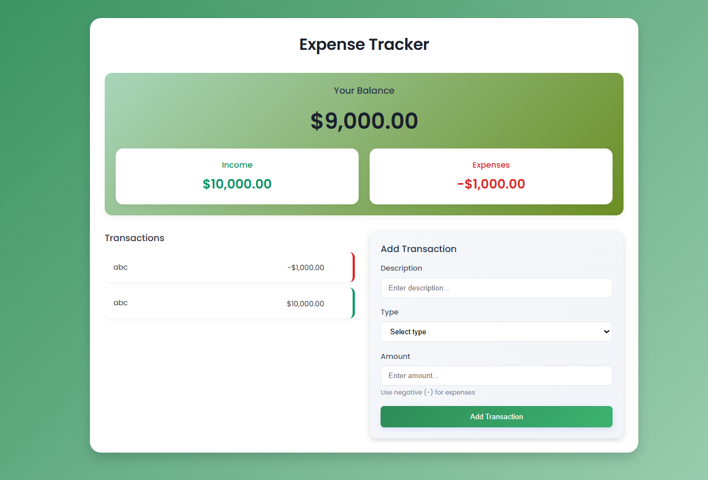

# 💸 Expense Tracker

A simple and clean **Expense Tracker** built using **Vanilla JavaScript**, HTML, and CSS.  
It allows users to track income and expenses, persist data using `localStorage`, and view a real-time balance summary.

This project focuses on **core JavaScript fundamentals** like DOM manipulation, array methods, state management, and browser storage.

---

## 🚀 Features

- Add income and expense transactions
- Automatic balance calculation
- Separate income and expense summary
- Persistent data using `localStorage`
- Delete individual transactions
- Currency formatting using `Intl.NumberFormat`
- Responsive and minimal UI

---

## 🛠️ Tech Stack

- **HTML5**
- **CSS3**
- **JavaScript (ES6+)**
- **Browser LocalStorage**

---

## 📸 Screenshots

